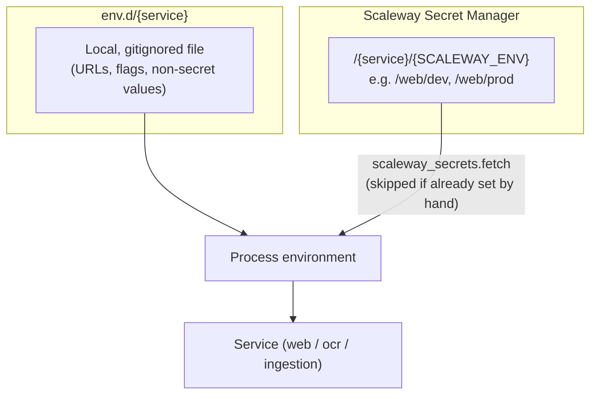
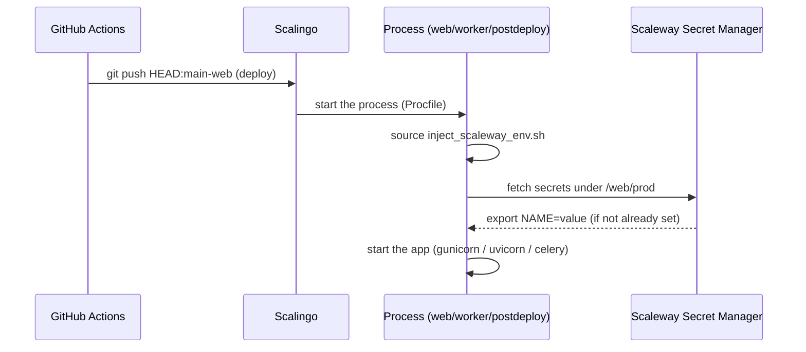

# Environment variables

How configuration (environment variables and secrets) is loaded in dev and in production, via Scaleway Secret Manager. For the mise tooling side (tasks, `_.file`, `_.source`), see also [`docs/mise.md`](./mise.md#environnement).

## Overview

Each service (`web`, `ocr`, `ingestion`) combines two sources, layered in this order:

1. **`env.d/{service}`**: a local, gitignored file (copied from `env.d/{service}-example` by `mise run setup`), for non-secret, machine-specific values (local URLs, debug flags, etc.).
2. **Scaleway Secret Manager**: the actual secrets (API keys, passwords, tokens), fetched dynamically when mise computes the environment or when the process starts, and which **complement** the `env.d` file without ever overriding it.

This is the same mechanism in dev, in CI, and in production (Scalingo) — only how the Scaleway credentials are supplied changes.



## In development

Each sub-project's `mise.toml` declares, in its `[env]` section:

```toml
[env]
_.file = "../../env.d/web"
_.python.venv = { path = ".venv" }
_.source = { path = "bin/inject_scaleway_env.sh", tools = true }
```

- `_.file` loads `env.d/web` (local values).
- `_.source` runs `bin/inject_scaleway_env.sh`, which queries Scaleway Secret Manager and exports whatever secrets are still missing.

`mise activate` recomputes this environment on every directory change: a mise task, or `mise en src/web` (sub-shell), always has the full configuration available, secrets included.

Prerequisite, once per machine: `scw init` (credentials stored in `~/.config/scw/config.yaml`), then set `SCALEWAY_ENV=dev` in `env.d/web` (already present in `env.d/web-example`). `mise run secrets:check` verifies access and lists the secret names available for each service, without printing their values.

Without `SCALEWAY_ENV` set, `bin/inject_scaleway_env.sh` is a no-op: the service runs with `env.d/{service}` alone.

> `notebook` is the exception: it has no `bin/inject_scaleway_env.sh` and no Scaleway secrets — its third-party credentials (Légifrance, Albert, OpenRouter, TalentSoft…) live in plain text directly in `env.d/notebook` (gitignored).

## The `inject_scaleway_env.sh` script

Each service has its own `bin/inject_scaleway_env.sh` (identical in principle for `web`, `ocr`, `ingestion`). It's meant to be *sourced*, not executed, so the exported variables persist in the calling shell:

```bash
source "$(dirname "$0")/inject_scaleway_env.sh"
```

It delegates the actual fetch to `libs/scaleway_secrets` (`python -m scaleway_secrets.fetch <service>`), which:

- lists every secret under `/{service}/{SCALEWAY_ENV}` in Scaleway Secret Manager;
- for each secret, if a variable of the same name is **already set** in the environment (e.g. set by hand on Scalingo), it's left untouched — Secret Manager never overrides it;
- otherwise, prints `export NAME=value`, which the bash script evaluates (`eval`).

Scaleway credentials come from the `scw` config file (`scw init`) in dev, or from the `SCW_ACCESS_KEY` / `SCW_SECRET_KEY` / `SCW_DEFAULT_PROJECT_ID` / `SCW_DEFAULT_REGION` environment variables in production (they take precedence over the config file when both exist).

A safety check prevents accidental misuse: `SCALEWAY_ENV=prod` is only allowed when `SCALINGO_APPLICATION_ID` is set, i.e. only on the Scalingo infrastructure.

## In production (Scalingo)

Application hosting (web, workers, deployment) runs on **Scalingo**; secrets themselves stay centralized in **Scaleway Secret Manager** — Scalingo is only the runtime.

Each `Procfile` sources the script before starting a process:

```
# src/web/Procfile
web: bash ./bin/start.sh
worker: bash ./bin/run_worker.sh
postdeploy: bash ./bin/postdeploy.sh
```

```bash
# bin/start.sh (excerpt)
source "$(dirname "${BASH_SOURCE[0]}")/inject_scaleway_env.sh"
...
gunicorn config.wsgi:application --log-file -
```

On Scalingo, `SCALEWAY_ENV=prod` and the `SCW_*` credentials are set once as application environment variables; at the start of each process (`web`, `worker`, `postdeploy`), the script fetches every secret under `/{service}/prod` before launching the actual command.

Deployment itself doesn't use the Scaleway API: the GitHub Actions CI (`.github/workflows/web.yml`, `ocr.yml`, `ingestion.yml`) simply pushes the `main` branch to a Scalingo deploy branch (`git push`, via the `.github/actions/scalingo-deploy` action), which triggers the build/deploy on Scalingo's side.



## Tests and CI

Test tasks load `env.test` (fake, versioned values, no network dependency) instead of `env.d/{service}`:

```toml
[tasks.test]
env = { _.file = "env.test" }
```

`mise.ci.toml`, layered on top of `mise.toml` in CI (`MISE_ENV=ci`), loads the same `env.test` and even disables the `scaleway-cli` tool (`disable_tools = ["scaleway-cli"]`). CI therefore never contacts Scaleway Secret Manager — which is why `inject_scaleway_env.sh` stays a no-op as long as `SCALEWAY_ENV` isn't set.

The root `mise.toml` also declares `redactions` (`*SECRET*`, `*_KEY`, `*PASSWORD*`, `*TOKEN*`, `*CREDENTIALS*`, `*DATABASE_URL*`) that mask these values in mise's logs/output, Scaleway secrets included.

## Adding or changing a secret

1. Create/update the secret in Scaleway Secret Manager, under `/{service}/{env}` (`dev`, `prod`…), with a secret name matching the expected variable name (case-insensitive — `fetch.py` uppercases it).
2. In dev: restart a mise shell (or `mise en src/web`) to reload the environment; verify with `mise run secrets:check`.
3. In production: nothing to redeploy — the secret is re-read the next time the process starts on Scalingo (manual restart or next deploy).

## Key files

| File | Role |
|---|---|
| `env.d/{service}-example` | Versioned template, copied by `mise run setup` |
| `env.d/{service}` | Local, gitignored file, non-secret values |
| `src/{service}/mise.toml` (`[env]`) | Declares `_.file` and `_.source` to load env.d + secrets |
| `src/{service}/bin/inject_scaleway_env.sh` | Script sourced by mise and by the Procfiles, no-op without `SCALEWAY_ENV` |
| `libs/scaleway_secrets/fetch.py` | Queries the Scaleway Secret Manager API, prints `export` lines |
| `src/{service}/env.test` | Fake values for tests / CI |
| `src/{service}/Procfile` | Scalingo commands (web, worker, postdeploy) |
